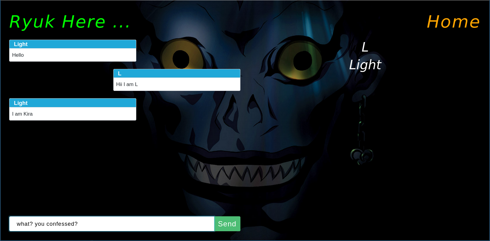

Ryu
===========

A Chat-Server developed in python using Tornado and PostgreSQL.

Details
--------

:Author: `Lowjack <https://github.com/lowjack1>`_.
:Email: harshit11541@gmail.com
:Author: `Masterbios <https://github.com/masterbios>`_.
:Email: ankitkp88534@gmail.com

Live Project
------------
**Link :** http://ryulow.cf/

Blogs
------------
`Ryu — A Chat Server in Tornado <https://medium.com/@lightl1018/ryu-a-chat-server-in-tornado-b3b573ab03b6>`_.

`Developing a chat server in Tornado <https://medium.com/@lightl1018/developing-a-chat-server-in-tornado-22b560d69a22>`_.

Technical Specs
----------------

:Tornado: Async Python Web Library + Web Server
:PostgreSQL: Relational Database System

Requirements
~~~~~~~~~~~~~~~~~~~~~~~~~~~~~~~~~~~~~~~~~

1. python 3.6+
2. tornado
3. aiohttp
4. asyncpg
5. python-dateutil

Features
---------

* Shows who joined and who left
* Shows list of users online
* Shows who is typing
* Join/Leave chat room features

Overview
---------

This is how the application will look like

Todo
-----

1. Add Sign-up functionality.
2. Create application with the help of message broker like RabbitMQ
3. Feature to shows who is typing and who is not
